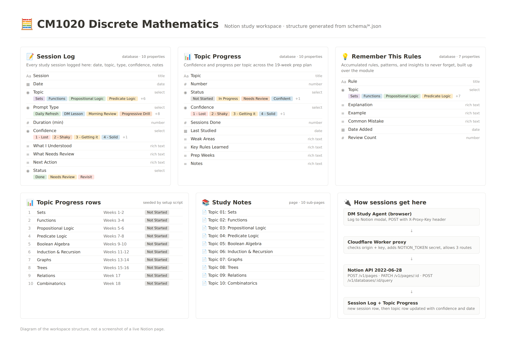

# CM1020 Notion Study Workspace

A Notion workspace for studying **University of London CM1020 Discrete Mathematics**, and a script that builds it for you in one command.



## What you get

- **Session Log:** one row per study session with topic, mode, duration, confidence (1 to 5), what you understood, what needs review, next action
- **Topic Progress:** all ten CM1020 topics pre-filled with prep weeks, status, and confidence
- **Remember This Rules:** the one-line rule from each session, with an example, a common mistake, and a review count
- **Study Notes:** a page per topic

It works on its own, and it is the logging backend for the [DM Study Agent](https://github.com/rosevillanuevadev/dm-study-agent).

## Build it (about two minutes)

Requires Node 18 or newer. No `npm install`.

1. In Notion: Settings → Connections → Develop or manage integrations → **New connection** → Access token. Copy the token.
2. Pick a page to hold the workspace, open ••• → **Connections**, and add your integration.
3. Copy that page's ID (the 32 characters at the end of its URL).
4. Run:

```bash
git clone https://github.com/rosevillanuevadev/cm1020-notion-workspace
cd cm1020-notion-workspace
NOTION_TOKEN=ntn_your_token PARENT_PAGE_ID=your_page_id node scripts/setup-workspace.mjs
```

Add `DRY_RUN=1` first to see every request without writing anything. When it finishes, the script prints the three database IDs to paste into the DM Study Agent's Settings.

Prefer to build it by hand? The property list for every database is in [docs/BUILD.md](docs/BUILD.md#2-schemas).

## Files

```
schema/                     database definitions in Notion API format
scripts/setup-workspace.mjs one-command builder
docs/BUILD.md               build documentation and weekly workflow
docs/CASE-STUDY.md          project case study
```

License: MIT
